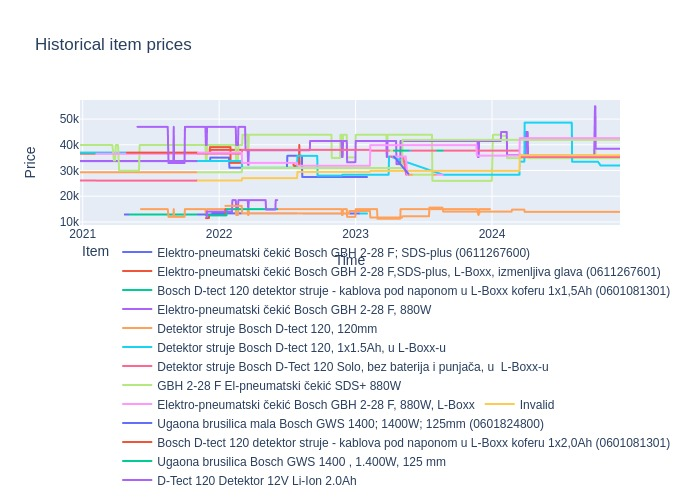

# price_scraper_github_actions
Scraping specific websites using git hub actions

#### References: 

Main idea from [1](https://simonwillison.net/2021/Mar/5/git-scraping/); 

Adapted from: 
[2](https://yasoob.me/posts/github-actions-web-scraper-schedule-tutorial/);
[3](https://canovasjm.netlify.app/2020/11/29/github-actions-run-a-python-script-on-schedule-and-commit-changes/#name-checkout-repo-content);
[4](https://docs.github.com/en/actions/quickstart);